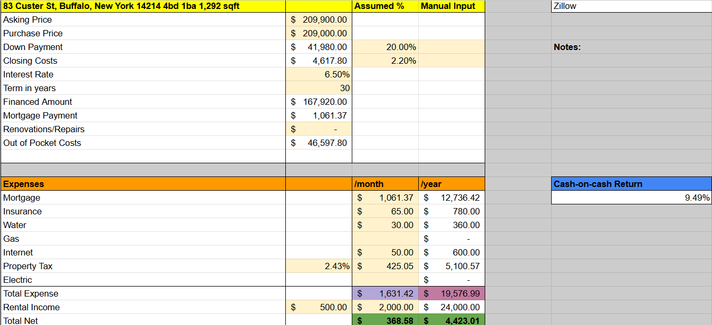

# 🏠 Rental Property Investment Analysis

A financial modeling project that analyzes rental property performance using Excel. This includes calculating metrics like cash flow, ROI, cap rate, and cash-on-cash return over a multi-year horizon.

---

## 📊 Project Overview

This Excel-based project helps evaluate rental property profitability based on key financial inputs such as rent, loan terms, expenses, and appreciation. The model provides monthly and annual cash flow projections, and generates investment metrics to support decision-making.

---

## 📂 Files Included

| File | Description |
|------|-------------|
| `rental-property-model.xlsx` | Main Excel workbook with the full analysis |
| `images/` | Screenshots of charts and dashboards |
| `README.md` | Project documentation |

---

## 💡 Key Features

- Monthly and annual cash flow analysis
- Cap rate, ROI, and cash-on-cash return calculations
- Mortgage amortization with loan inputs
- Customizable for any property or scenario
- Visual charts for cash flow and value growth

---

## 🖼️ Preview

### 📈 Cash Flow Over Time

---

## 🛠 Tools Used

- **Microsoft Excel** – Data modeling, formulas, pivot tables, and charts
- **CSV** – Used for raw data import
- **Public MLS Listings*** - Used websites like Zillow, Redfin, Homes to conduct market analysis

---

## 🙋‍♂️ About Me

Created by [Patrick Chen]. I'm passionate about real estate analysis, finance, and building tools that help investors make smarter decisions.

Feel free to connect on [LinkedIn](https://linkedin.com/in/patrick-chen3) or check out more of my projects!
